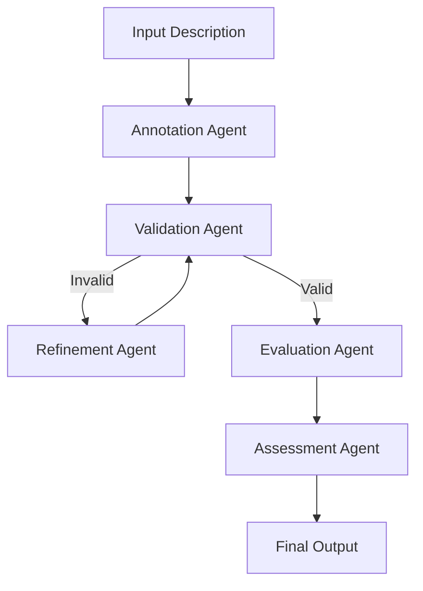

# HEDit

HEDit is a multi-agent system for generating valid [HED (Hierarchical Event Descriptors)](https://hedtags.org) annotations from natural language descriptions.

## Overview

HEDit uses a LangGraph-based multi-agent workflow to:

1. **Generate** HED annotations from natural language event descriptions
2. **Validate** annotations against the HED schema
3. **Evaluate** annotation completeness and faithfulness
4. **Refine** annotations through iterative improvement

## Features

- **CLI Tool**: Command-line interface for local annotation generation
- **REST API**: HTTP API for integration with other tools
- **Web Interface**: Browser-based UI at [hedit.pages.dev](https://hedit.pages.dev)
- **BYOK Support**: Bring Your Own Key for API billing control
- **Multiple Schemas**: Support for HED schema versions 8.3.0, 8.4.0, and newer

## Installation

=== "pip"

    ```bash
    pip install hedit
    ```

=== "From source"

    ```bash
    git clone https://github.com/Annotation-Garden/hedit
    cd hedit
    pip install -e .
    ```

## Quick Start

### CLI Usage

```bash
# Initialize with your OpenRouter API key
hedit init --api-key YOUR_OPENROUTER_KEY

# Generate annotation from text
hedit annotate "A red circle appears on the left side of the screen"

# Generate annotation from image
hedit annotate-image stimulus.png

# Validate existing HED string
hedit validate "Sensory-event, Visual-presentation"
```

### API Usage

```python
import httpx

# Using the public API with BYOK
response = httpx.post(
    "https://api.annotation.garden/hedit/annotate",
    json={
        "description": "A red circle appears on the left side of the screen",
        "schema_version": "8.3.0",
        "max_validation_attempts": 5
    },
    headers={"X-OpenRouter-Key": "your-openrouter-key"}
)

result = response.json()
print(f"Annotation: {result['annotation']}")
print(f"Valid: {result['is_valid']}")
```

## Architecture



## Documentation

- [CLI Reference](cli-reference.md): Complete command-line interface documentation
- [API Reference](api-reference.md): REST API endpoints and models
- [Python API](python-api.md): Python module documentation

## Links

- **Repository**: [github.com/Annotation-Garden/hedit](https://github.com/Annotation-Garden/hedit)
- **API Endpoint**: [api.annotation.garden/hedit](https://api.annotation.garden/hedit)
- **Web Interface**: [hedit.pages.dev](https://hedit.pages.dev)
- **PyPI Package**: [pypi.org/project/hedit](https://pypi.org/project/hedit) (coming soon)
