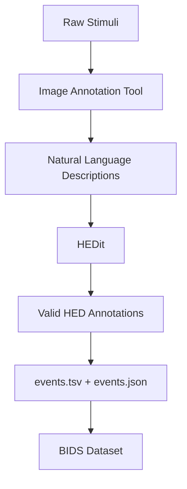

# Standards

AGI builds on established neuroscience data standards to ensure interoperability and long-term value of annotations.

## Core Standards

-   :material-tag-multiple:{ .lg .middle } **HED (Hierarchical Event Descriptors)**

    ---

    A standardized vocabulary for describing events in behavioral experiments.

    [:octicons-arrow-right-24: HED Guidelines](hed-guidelines.md)

-   :material-database:{ .lg .middle } **BIDS (Brain Imaging Data Structure)**

    ---

    A standard for organizing neuroimaging data and metadata.

    [:octicons-arrow-right-24: BIDS Integration](bids-integration.md)

-   :material-file-document-multiple:{ .lg .middle } **Stim-BIDS (BEP044)**

    ---

    Extension for organizing stimulus files and their annotations.

    [:octicons-arrow-right-24: Annotation Format](annotation-format.md)

## Why Standards Matter

### The Annotation Gap

Naturalistic stimuli datasets are **rich in information but poor in annotation**. While a 2-hour movie contains millions of visual frames, emotional beats, dialogue, and scene changes, typical datasets arrive with only basic timing information.

This creates a fundamental problem:

| Analysis Type | Annotation Requirement |
|---------------|------------------------|
| Hyperalignment | Low (timing only) |
| Functional connectivity | Low (timing only) |
| GLM-based analytics | **High** (event descriptions) |
| Encoding models | **High** (feature annotations) |
| Representational similarity | **High** (stimulus features) |

The result: researchers default to simpler paradigms despite rich data, because the annotation burden is prohibitive.

### AGI's Solution

AGI provides:

1. **Standardized format** via HED and Stim-BIDS
2. **Version control** via GitHub
3. **Collaborative curation** via PRs and issues
4. **Automated validation** via HEDit
5. **Community building** via shared repositories

## Standard Integration

## Key Resources

| Standard | Documentation | Schema |
|----------|--------------|--------|
| HED | [hedtags.org](https://hedtags.org) | [hed-schemas](https://github.com/hed-standard/hed-schemas) |
| BIDS | [bids.neuroimaging.io](https://bids.neuroimaging.io) | [bids-specification](https://github.com/bids-standard/bids-specification) |
| Stim-BIDS | [BEP044](https://github.com/bids-standard/bids-specification/pull/2022) | In development |

## Validation Tools

- **HEDit**: AI-powered HED annotation generation and validation
- **hed-validator**: Official HED validation library
- **bids-validator**: BIDS dataset validation
